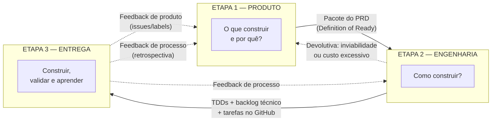
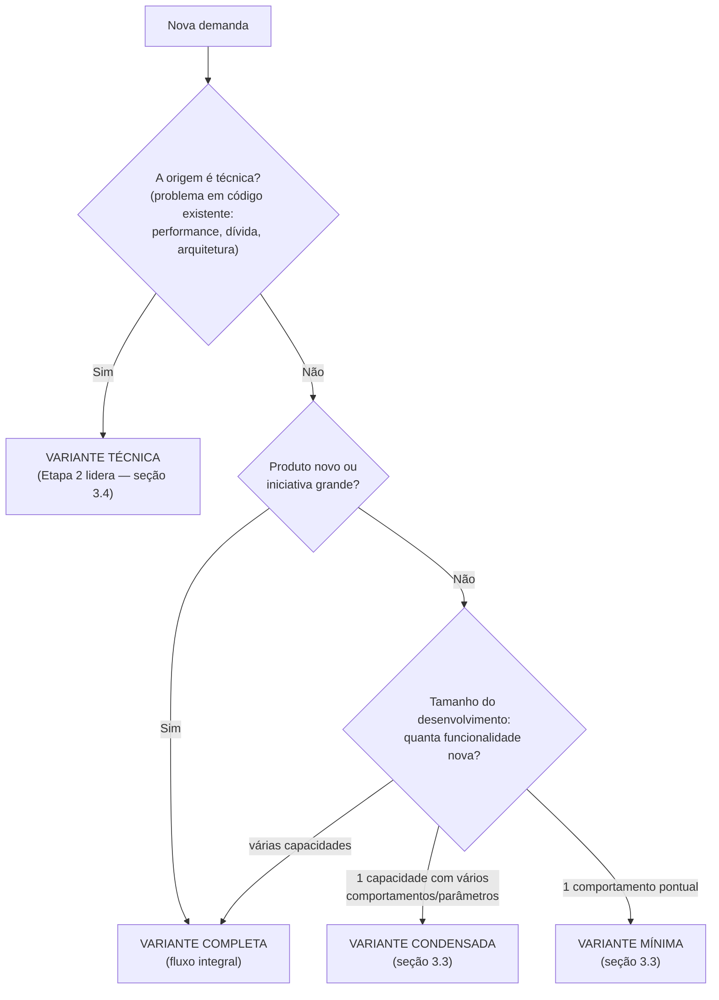
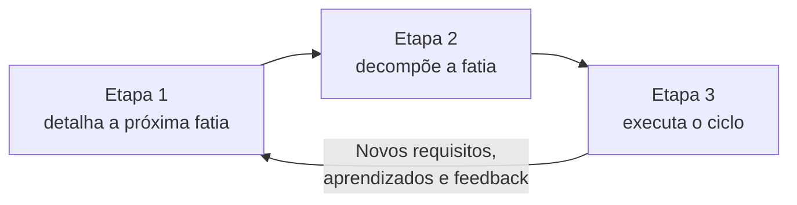
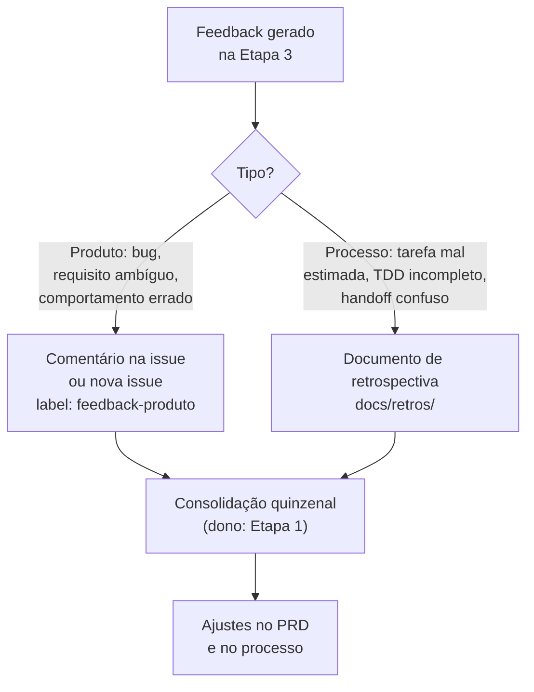

# Fluxo de Desenvolvimento de Software

> Documento de referência para o fluxo de trabalho da equipe: do briefing ao pós-lançamento.
> Público: todas as pessoas envolvidas nas três etapas do processo.

---

## Introdução

Este documento define **como a equipe trabalha**: o processo completo que uma demanda percorre, do primeiro briefing até o aprendizado pós-lançamento. Ele existe para que qualquer pessoa — nova no time ou veterana — saiba o que fazer, o que entregar e o que esperar de cada etapa, sem depender de conhecimento tácito.

Em síntese, o fluxo se apoia em sete ideias centrais:

1. **Três etapas, três perguntas** — Produto (*o que construir e por quê?*, 1–2 pessoas), Engenharia (*como construir?*, 1–2 pessoas) e Entrega (*construir, validar e aprender*, 3–5 pessoas), cada uma com artefatos obrigatórios e um gate explícito de passagem.
2. **Um fluxo, quatro profundidades** — toda demanda é classificada por triagem objetiva em uma variante (Completo, Condensado, Mínimo ou Técnico), que define quanto cada etapa produz. A espinha dorsal nunca muda.
3. **Tudo documentado no repositório** — briefing, PRD, TDDs, ADRs e retrospectivas vivem em Markdown junto com o código: fonte única de verdade, versionada e rastreável.
4. **Tudo rastreado em tarefas no GitHub** — cada demanda tem um épico e uma tarefa por artefato, com responsável e status visíveis no board. O que não tem tarefa não está sendo feito.
5. **O funil é contínuo** — as etapas se repetem por fatia de escopo, não uma vez por projeto. Requisitos emergem ao longo do caminho e são absorvidos por triagem, nunca informalmente: a Etapa 3 nunca decide requisito.
6. **Feedback com dono e cadência** — o ciclo só se fecha quando os aprendizados voltam, consolidados, para o processo.
7. **Um único dono por decisão** — participação pode ser ampla; responsabilidade final é sempre singular.

**Como ler este documento:** a seção 1 apresenta a visão geral; a seção 2 é o glossário de termos e siglas (consulte sempre que um termo for estranho); as seções 3 e 4 explicam como as demandas são classificadas e rastreadas; as seções 5 a 10 detalham cada etapa e seus artefatos; a seção 11 traz os templates prontos para uso; e as seções 12 a 14 fecham com o anexo WordPress, a matriz de responsabilidades e os princípios do fluxo.

---

## 1. Visão geral

O processo é dividido em **três etapas**, cada uma com um time responsável, um conjunto de artefatos obrigatórios e um **contrato de passagem** (gate) que precisa ser cumprido antes de a etapa seguinte começar.



| Etapa | Pergunta central | Time | Liderança |
|---|---|---|---|
| 1 — Produto | O que construir e por quê? | 1–2 pessoas | Persona PM/PO |
| 2 — Engenharia | Como construir? | 1–2 pessoas | Persona Tech Lead/Arquiteto |
| 3 — Entrega | Construir, validar e aprender | 3–5 pessoas | Persona Gerente de Projeto + Devs |

**Princípio fundamental:** se uma decisão não está documentada no repositório, ela não existe para as outras etapas.

**O fluxo é um só.** O que varia conforme o tipo de demanda é a profundidade de cada etapa — ver a seção 3 (Variantes e triagem), que é parte obrigatória deste processo.

**O fluxo é rastreado por tarefas.** Todo trabalho de todas as etapas existe como tarefa no GitHub — ver seção 4 (Rastreamento operacional).

**O fluxo é contínuo.** As três etapas não acontecem uma vez por projeto, mas uma vez por fatia de escopo — ver seção 9 (Requisitos emergentes).

**Termos técnicos:** todos os termos e siglas usados neste documento estão definidos no **Glossário (seção 2)**. As primeiras ocorrências no texto linkam para lá.

---

## 2. Glossário

| Termo | Significado |
|---|---|
| **ADR** (Architecture Decision Record) | Registro curto de uma decisão técnica relevante: contexto, decisão tomada e consequências. Fica em `docs/03-tdd/adr/`. |
| **Assignee** | Pessoa atribuída como responsável por uma issue no GitHub. Toda tarefa deste fluxo nasce com um. |
| **Baseline** | Conjunto de métricas medidas *antes* de uma mudança, usado como base de comparação. Obrigatório na variante Técnica. |
| **Big bang** | Reescrita completa de uma vez, sem entregas incrementais. Proibido na variante Técnica — refatora-se em fatias. |
| **Board** | Quadro do GitHub Projects com colunas de status (`Não iniciada` → `Em andamento` → `Em revisão` → `Entregue`). |
| **Caracterização (testes de)** | Testes escritos sobre o código atual, mesmo que ruim, para documentar o comportamento existente antes de alterá-lo. |
| **Critérios de aceite** | Condições objetivas que definem quando uma tarefa ou entrega está concluída. Inegociáveis em todas as variantes. |
| **Definition of Ready (DoR)** | Checklist que define quando o pacote da Etapa 1 está pronto para a Etapa 2 começar. |
| **Devolutiva** | Retorno formal da Etapa 2 à Etapa 1 quando o PRD apresenta problemas de viabilidade ou custo. |
| **Épico (issue-mãe)** | Issue criada na triagem que representa a demanda inteira e agrupa todas as tarefas-filhas das três etapas. |
| **Fatia** | Porção de escopo detalhada e pronta para entrar na Etapa 3 em um ciclo. O fluxo processa fatias, não projetos inteiros de uma vez. |
| **Fora de escopo** | Lista explícita do que **não** será feito. Obrigatória em todas as variantes. |
| **Gate** | Contrato de passagem entre etapas. Cumprido quando todas as tarefas de artefato da etapa estão fechadas. |
| **Handoff** | Passagem de bastão entre etapas ou pessoas — ponto típico de perda de contexto, mitigado pelos artefatos. |
| **Issue** | Registro de trabalho no GitHub (tarefa, bug, feedback). Unidade básica de rastreamento deste fluxo. |
| **Jornada** | Sequência de passos que um usuário percorre para atingir um objetivo no produto. |
| **Label** | Etiqueta do GitHub usada para classificar issues: variante do fluxo, etapa, tipo de feedback. Labels de **dimensão** (ex.: `gestão`, `performance`) classificam a natureza do trabalho — múltiplas por issue, informativas (ADR-005). |
| **Milestone** | Marco do GitHub que agrupa as issues de um ciclo de entrega. |
| **MVP** (Minimum Viable Product) | Menor versão do produto que entrega valor e permite validar hipóteses. Separado das fases seguintes no PRD. |
| **Paridade** | Garantia de que, após uma refatoração, o comportamento observável do sistema permanece idêntico ao anterior. |
| **PM / PO** (Product Manager / Product Owner) | Persona de produto: dona do "o quê" e do "por quê". Lidera a Etapa 1. |
| **PRD** (Product Requirements Document) | Documento de requisitos do produto: requisitos funcionais e não funcionais, regras de negócio, fora de escopo. Documento vivo, que cresce a cada fatia. |
| **QA** (Quality Assurance) | Função de garantia de qualidade; valida as entregas contra os critérios de aceite. |
| **Quirk** | Comportamento estranho ou inesperado do código atual, que precisa ser preservado ou explicitamente autorizado a mudar. |
| **Regressão (testes de)** | Testes que garantem que o que já funcionava continua funcionando após uma mudança. |
| **Retrospectiva** | Registro de aprendizados de processo ao fim de um ciclo, salvo em `docs/retros/`. |
| **RF** (Requisito Funcional) | O que o sistema deve fazer. Identificado no PRD como RF-01, RF-02... |
| **RNF** (Requisito Não Funcional) | Qualidades e restrições do sistema (performance, segurança, compatibilidade). Identificado como RNF-01, RNF-02... |
| **Rolling wave planning** | Técnica de planejamento em ondas: detalha-se bem o ciclo próximo e deixa-se os ciclos futuros propositalmente em alto nível, refinando-os quando se aproximam. |
| **Scope creep** | Crescimento informal e não rastreado do escopo ("já que está mexendo aí, aproveita e..."). Combatido pela regra de que todo requisito novo vira demanda triada. |
| **Stakeholder** | Qualquer parte interessada no produto: cliente, usuário, patrocinador, áreas da empresa. |
| **Sub-issue** | Issue filha vinculada nativamente a outra issue no GitHub — base da hierarquia épico/tarefas. |
| **TDD** (Technical Design Document) | Documento de desenho técnico produzido na Etapa 2. **Atenção:** neste documento, TDD *não* significa Test-Driven Development. |
| **Tipo de issue** | Campo nativo do GitHub que classifica a issue como Bug, Feature ou Task — um por issue. Definido na triagem (derivado do texto da demanda); na captura rápida, um palpite curado confirmado na promoção. Informativo — nada no fluxo o consome (ADR-005). |
| **Tech Lead** | Persona de liderança técnica: dona do "como". Lidera a Etapa 2. |
| **User story** | Descrição curta de uma necessidade do usuário ("como [papel], quero [ação] para [benefício]"). |
| **Variante** | Nível de profundidade do fluxo para uma demanda: Completo, Condensado, Mínimo ou Técnico. |

---

## 3. Variantes do fluxo e triagem

Não existem fluxos separados para tipos diferentes de demanda. Existe **este fluxo**, com **quatro variantes de profundidade**. A espinha dorsal é sempre a mesma — três etapas, gates, artefatos no repositório, rastreabilidade e feedback consolidado. O que muda é *quanto* cada etapa produz.

### 3.1 As quatro variantes

| Variante | Quando usar | Origem da demanda | Exemplo |
|---|---|---|---|
| **Completo** | Produto novo, iniciativa grande ou funcionalidade muito complexa | Etapa 1 | Novo produto, nova plataforma, exportador de múltiplos tipos de relatório |
| **Condensado** | Funcionalidade inteira de porte médio em produto existente | Etapa 1 | Plugin de exportação de relatórios com parâmetros (fase, formato, colunas) |
| **Mínimo** | Mudança pequena e bem delimitada | Etapa 1 | Ajuste de regra de negócio, correção, plugin/tema simples, checkbox + configuração |
| **Técnica** | Refatoração de algo já implementado | **Etapa 2** | Melhorar performance ou arquitetura de uma funcionalidade existente |

A variante **Técnica** é a única que inverte a origem: a demanda nasce na Engenharia, e a Etapa 1 entra como aprovadora — ver detalhes na seção 3.4.

### 3.2 Triagem — como classificar cada demanda

Toda demanda que chega passa por uma triagem rápida (alvo: 5 minutos) **antes de qualquer trabalho começar** — inclusive demandas que surgem no meio da execução de outra (ver seção 9).

**Quem faz:** uma pessoa da Etapa 1. Se a origem for claramente técnica (refatoração), a triagem é feita em conjunto com uma pessoa da Etapa 2.

**Onde fica registrado:** na **issue-mãe (épico)** criada no ato da triagem, que recebe a label da variante (ex.: `variante-completo`, `variante-condensado`, `variante-minimo`, `variante-tecnica`) — ver seção 4. Triagem sem registro não aconteceu.

**Classificação da issue (tipo + dimensão):** toda issue classificada na triagem nasce com **tipo** no campo nativo da plataforma (Bug/Feature/Task — derivado do texto da demanda, confirmável como os demais critérios; um por issue) e com **labels de dimensão** quando fizer sentido ao trabalho descrito (`gestão`, `melhoria`, `performance`, `devops`, `documentação` — múltiplas por issue, criadas sob demanda de forma idempotente). Issues criadas manualmente seguem a mesma convenção. A classificação é puramente informativa: nada no fluxo a consome — sem mapeamento para colunas do board, sem leitura pelo digest (ver ADR-005).



### 3.3 Critérios objetivos de escala

A classificação mede o **tamanho do desenvolvimento** — a quantidade de funcionalidade nova construída — como eixo principal:

| Tamanho | O que é | Variante |
|---|---|---|
| **1 comportamento pontual** | Ajuste/adição delimitada em superfície existente; plugin/tema de propósito único | **Mínimo** |
| **1 capacidade coerente com vários comportamentos/parâmetros** | Funcionalidade inteira de porte médio (plugin com parâmetros, módulo novo) | **Condensado** |
| **Várias capacidades/sub-recursos** | Funcionalidade muito complexa | **Completo** |

A contagem estrutural é o **desempate final** contra qualquer outro sinal: um comportamento só nunca sobe para Condensado por parecer lento; várias capacidades nunca descem para Mínimo porque "a IA escreve rápido".

**Sinais secundários — pesam, nunca gatilham sozinhos:**

- Estimativa de esforço em **dias de trabalho assistido por IA** (~1 dia assistido pesa Mínimo; vários dias assistidos pesam Condensado) — o desenvolvimento aqui é assistido; estimar nesses termos
- Toca **3 ou mais** módulos/regiões — conta só com **trabalho substancial em cada um**; atravessamento fino (um checkbox aqui, uma variável de ambiente ali) não conta
- Altera **modelo de dados** ou **contrato público** (API, hooks, interface exposta)
- Exige **decisão técnica nova** com consequência duradoura
- Afeta **comportamento já usado** por usuários (risco de regressão relevante)

Numa demanda pequena (1 comportamento pontual), os três últimos sinais **não sobem a variante**: viram pendências rastreadas e cuidados dentro da própria Mínima — comentário técnico na issue + critérios de aceite cobrindo o comportamento existente — com reclassificação declarada se a análise da Etapa 2 revelar porte maior.

E sobe de **Condensado** para **Completo** se for, na prática, uma iniciativa com identidade própria: métricas de sucesso próprias, múltiplas jornadas afetadas ou orçamento/prazo dedicados.

> **Calibração — escada de exemplos (âncora objetiva):**
> - Exportador de múltiplos tipos de relatório (editais, projetos, inscrições, dados cadastrais) → **Completo**
> - Plugin de exportação com parâmetros (fase, formato, colunas) → **Condensado**
> - Plugin que exporta um relatório específico (ex.: inscrições da 1ª fase em CSV) → **Mínimo**
> - Checkbox numa modal + valor default via variável de ambiente → **Mínimo**
>
> Os exemplos e números acima são valores calibráveis. A equipe deve revê-los nas retrospectivas e ajustá-los à realidade — mas sempre mantendo critérios **objetivos e escritos aqui**, nunca no "a gente sente que...".

### 3.4 Detalhamento por variante

#### Variante Completa

É o fluxo integral descrito nas seções 5 a 10, sem cortes.

#### Variante Condensada (nova funcionalidade em produto existente)

O contexto já existe — produto vivo, arquitetura decidida. O que muda:

- **Etapa 1:** mini-briefing (problema, métrica de sucesso, **impacto no que já existe**) + seção incremental no [PRD](#2-glossário) com novos [RF/RNF](#2-glossário) seguindo a mesma numeração + critérios de aceite. Jornadas: apenas as afetadas.
- **Etapa 2:** sem [TDD](#2-glossário) de arquitetura (ela já existe). Faz **análise de fit** com a arquitetura atual + [ADR](#2-glossário) **somente se** houver decisão nova + tarefas no GitHub.
- **Etapa 3:** idêntica, com peso maior em **testes de regressão** — o principal risco de feature em produto existente é quebrar o que funciona.

#### Variante Mínima (mudança pequena e bem delimitada)

- **Etapa 1:** uma issue bem escrita funciona como PRD — problema, comportamento esperado, critérios de aceite, fora de escopo.
- **Etapa 2:** um comentário técnico na própria issue — abordagem, o que será tocado, decisões (se houver).
- **Etapa 3:** normal — implementação, validação contra os critérios, feedback.

> **Mínimo não é "sem critérios de aceite".** A única coisa que nunca pode ser cortada, em nenhuma variante, é o critério de aceite — é ele que fecha o ciclo na Etapa 3.

#### Variante Técnica (refatoração)

A refatoração inverte o fluxo: a demanda **nasce na Etapa 2**, e a Etapa 1 entra como aprovadora.

**Etapa 2 — autora da demanda:**

- **Documento de motivação** (equivalente ao mini-briefing): qual o problema concreto — dívida que trava evolução, performance degradada, acoplamento que gera bugs recorrentes. Com **evidência**: métricas, histórico de bugs na área, tempo que tarefas naquela região levam.
- **Meta mensurável:** "melhorar a arquitetura" não é meta; "reduzir tempo de resposta de X para Y" ou "desacoplar o módulo Z para permitir a feature W" é. A meta é também o **ponto de parada** — sem ela, refatoração vira reescrita infinita.
- **Análise de impacto:** o que a refatoração toca e quais funcionalidades dependem daquela região.

**Etapa 1 — aprovadora:**

- **Aprova o custo de oportunidade:** vale gastar N dias nisso em vez de features? Decisão de produto, não de engenharia.
- **Define o que é inegociável preservar:** quais comportamentos o usuário não pode perceber que mudaram — e quais **podem mudar de propósito** (isso precisa ser explícito).

**O "PRD da refatoração" é a caracterização do comportamento atual:**

- **Testes de caracterização** sobre o código atual (mesmo o código ruim): documentam o que ele faz hoje, incluindo os quirks.
- **Métricas de baseline:** medidas *antes* da mudança, para comparação posterior.
- Sem caracterização, "funciona igual" é achismo — e a Etapa 3 não tem como validar nada.

**Etapa 3 — duas regras específicas:**

- **Refatorar em fatias, nunca big bang:** cada fatia entrega paridade de comportamento incrementalmente.
- **Critérios de aceite duplos:** (a) **paridade** — testes de caracterização passando, comportamento preservado; (b) **melhoria** — meta da Etapa 2 atingida, com métricas comparadas ao baseline.

### 3.5 Matriz de artefatos por variante

| Artefato | Completo | Condensado | Mínimo | Técnica |
|---|---|---|---|---|
| Descoberta/briefing | Documento | Mini-briefing | Descrição da issue | Documento de motivação (Etapa 2) |
| PRD | Documento completo | Seção incremental | Issue bem escrita | Caracterização do comportamento atual |
| Jornadas | Mapa completo | Só as afetadas | Não | Não |
| Critérios de aceite | **Sempre** | **Sempre** | **Sempre** | **Sempre** (paridade + meta) |
| TDD arquitetura | Sim | Não (já existe) | Não | Não (já existe) |
| ADR | Decisões novas | Só se decisão nova | Só se duradoura | Só se decisão nova |
| Análise de impacto/regressão | — | **Obrigatória** | Recomendada | **Obrigatória** |
| Métricas de baseline | — | — | — | **Obrigatória** |
| Tarefas no GitHub | Sim | Sim | Sim | Sim |
| Feedback consolidado | Sim | Sim | Sim | Sim |

### 3.6 Riscos que a triagem precisa capturar

1. **Tudo vira "Mínimo" por conveniência — ou "Condensado" por sinal isolado.** Por isso o eixo principal é estrutural (quantidade de funcionalidade nova) e os sinais secundários são objetivos e escritos: a contagem decide, e nenhum sinal sobe sozinho uma demanda pequena — sem exceção informal nos dois sentidos.
2. **Refatoração disfarçada de feature (e vice-versa).** A tarefa diz "corrigir X" mas na prática reescreve o módulo. Se o escopo real é reescrever, segue a variante Técnica — com caracterização, baseline e meta.
3. **Reclassificação é legítima.** Se durante o trabalho a demanda crescer, qualquer pessoa pode pedir reclassificação — registra-se a mudança de label e segue a variante nova. O que não pode é executar uma demanda grande com artefatos de demanda pequena.
4. **Variantes divergirem com o tempo.** Como as variantes vivem neste documento único, qualquer ajuste no processo se aplica às quatro. Não criar documentos separados por variante.

---

## 4. Rastreamento operacional no GitHub

Todo o fluxo é acompanhado por tarefas no GitHub. **O que não tem tarefa criada não está sendo feito.** O objetivo é que qualquer pessoa consiga ver, a qualquer momento: o que está em andamento, o que está entregue e o que não foi iniciado — sem reunião de status.

### 4.1 Hierarquia: issue-mãe (épico) + tarefas por artefato

Cada demanda tem uma estrutura de dois níveis:

```text
Issue-mãe (épico) — criada na TRIAGEM
│   labels: variante-condensado
│   "Implementar exportação de relatórios"
│
├── Tarefa: Mini-briefing               → assignee: pessoa Etapa 1
├── Tarefa: Seção no PRD (RF/RNF)       → assignee: pessoa Etapa 1
├── Tarefa: Critérios de aceite         → assignee: pessoa Etapa 1
│         ── gate: Etapa 1 concluída ──
├── Tarefa: Análise de fit              → assignee: pessoa Etapa 2
├── Tarefa: ADR (se necessário)         → assignee: pessoa Etapa 2
├── Tarefa: Decomposição técnica        → assignee: pessoa Etapa 2
│         ── gate: Etapa 2 concluída ──
├── Tarefa: Implementação — fatia 1     → assignee: dev Etapa 3
└── Tarefa: Implementação — fatia 2     → assignee: dev Etapa 3
```

**Por que uma tarefa por artefato, e não uma tarefa única com checkboxes:**

- Checkbox **não tem dono** — tarefa tem assignee (casa com a regra de "um único dono")
- Checkbox **não aparece no board** — tarefa é um cartão próprio com status visível
- Checkbox **não paraleliza** — duas pessoas em artefatos diferentes ficam invisíveis uma para a outra
- Checkbox **esconde bloqueio** — um artefato travado esperando stakeholder não aparece em lugar nenhum

**E por que a issue-mãe:** sem ela, as tarefas se pulverizam e ninguém vê o todo. O épico é o ponto único de acompanhamento da demanda, com progresso agregado das tarefas-filhas (usar o recurso nativo de sub-issues do GitHub).

### 4.2 Ondas de criação de tarefas

As tarefas não são criadas todas de uma vez. Cada etapa cria a onda seguinte ao passar pelo seu gate:

| Momento | Quem cria | O que cria | Atribuído a |
|---|---|---|---|
| **Triagem** | Etapa 1 (com Etapa 2 na variante Técnica) | Issue-mãe com label da variante + tarefas de artefato da Etapa 1 (na Técnica: tarefas da Etapa 2) | Pessoas da etapa correspondente, já no ato da criação |
| **Gate da Etapa 1 cumprido** | Etapa 1 | Tarefas de artefato da Etapa 2 | Pessoas da Etapa 2 |
| **Gate da Etapa 2 cumprido** | Etapa 2 | Tarefas de implementação da Etapa 3 | Pessoas da Etapa 3 |
| **Etapa 3 em andamento** | Qualquer pessoa | Issues de feedback (seção 10) ou novas demandas (seção 9) | Conforme consolidação/triagem |

Regra: **toda tarefa nasce com assignee**. Tarefa sem responsável é tarefa sem dono — e volta para quem a criou.

### 4.3 Os gates como estado do board

Com este modelo, os gates deixam de ser conceito abstrato: **o gate de uma etapa está cumprido quando todas as suas tarefas-filhas estão fechadas**. A etapa seguinte só cria suas tarefas depois disso. O progresso inteiro da demanda é visível no board — sem reunião de status.

### 4.4 Escala por variante

A estrutura de tarefas segue a profundidade da variante — não se cria burocracia de épico para demanda pequena:

| Variante | Estrutura de tarefas |
|---|---|
| **Completa** | Épico + uma tarefa por artefato da Etapa 1 + uma por artefato da Etapa 2 + tarefas de implementação |
| **Condensada** | Igual, com menos artefatos (seguindo a matriz da seção 3.5) |
| **Mínima** | **Uma issue só** — ela já é o artefato e a tarefa ao mesmo tempo |
| **Técnica** | Épico + tarefas da Etapa 2 (motivação, baseline, caracterização, obtenção da aprovação da Etapa 1) + fatias de refatoração |

### 4.5 Convenções

- **Labels de variante:** `variante-completo`, `variante-condensado`, `variante-minimo`, `variante-tecnica` — aplicadas na issue-mãe
- **Labels de etapa:** `etapa-1`, `etapa-2`, `etapa-3` — aplicadas em cada tarefa-filha, permitindo filtrar o board por fase
- **Vínculo:** toda tarefa-filha referencia a issue-mãe (sub-issue nativa)
- **Assignee obrigatório** em toda tarefa
- **Milestones** representam os ciclos de entrega da Etapa 3
- **Board (GitHub Projects):** colunas sugeridas: `Não iniciada` → `Em andamento` → `Em revisão` → `Entregue`

### 4.6 Tipos de tarefa e templates

Existem dois tipos de tarefa-filha, com templates diferentes (ambos na seção 11):

- **Tarefa de artefato** (Etapas 1 e 2): o entregável é um documento no repositório. O critério de aceite é o item correspondente da Definition of Ready / gate da etapa — template na seção 11.2
- **Tarefa de implementação** (Etapa 3): o entregável é código + testes via PR. O critério de aceite vem do PRD (ou da caracterização, na variante Técnica) — template na seção 11.1

---

## 5. Repositório como fonte única de verdade

Todos os artefatos — das três etapas e de todas as variantes — vivem no repositório do projeto, em Markdown, versionados junto com o código.

```text
/
├── docs/
│   ├── 01-descoberta/
│   │   ├── briefing.md
│   │   ├── contexto-e-restricoes.md
│   │   └── metricas-de-sucesso.md
│   ├── 02-prd/
│   │   ├── prd.md
│   │   ├── jornadas.md
│   │   └── escopo-mvp.md
│   ├── 03-tdd/
│   │   ├── arquitetura.md
│   │   ├── modelo-de-dados.md
│   │   ├── contratos-api.md
│   │   └── adr/
│   │       ├── ADR-001-titulo-da-decisao.md
│   │       └── ...
│   ├── refatoracoes/
│   │   ├── 2026-08-motivacao-modulo-x.md
│   │   └── ...
│   └── retros/
│       ├── 2026-08-ciclo-1.md
│       └── ...
└── .github/
    └── ISSUE_TEMPLATE/
        ├── tarefa-implementacao.md
        ├── tarefa-artefato.md
        ├── bug.md
        └── feedback-produto.md
```

Por que tudo no repositório:

- **Versão única:** ninguém trabalha sobre um PDF desatualizado.
- **Rastreabilidade:** cada tarefa do GitHub linka a seção do PRD/TDD que a originou.
- **Histórico:** quando o PRD muda, o diff mostra o quê e quando.
- **Futuro agêntico:** agentes de IA leem o repositório; documentos fora dele ficam invisíveis para eles.

---

## 6. Etapa 1 — Produto (o quê construir?)

**Time:** 1–2 pessoas · **Persona:** PM/PO

### Sub-etapas e artefatos

| # | Sub-etapa | Artefato de saída | Local |
|---|---|---|---|
| 1.1 | Descoberta: briefing, contexto, problema, métricas de sucesso, restrições | Documento de descoberta | `docs/01-descoberta/` |
| 1.2 | Jornadas + user stories + critérios de aceite | Mapa de jornadas + stories | `docs/02-prd/jornadas.md` |
| 1.3 | Prototipação conceitual (se houver UI) | Wireframes/fluxos | referenciados no PRD |
| 1.4 | PRD: requisitos, regras de negócio, **fora de escopo explícito** | PRD consolidado | `docs/02-prd/prd.md` |
| 1.5 | Validação com stakeholders + priorização + definição de [MVP](#2-glossário) | PRD aprovado + escopo do MVP | `docs/02-prd/escopo-mvp.md` |

> Nas variantes Condensada e Mínima, esta etapa se reduz conforme a seção 3.4. Na variante Técnica, a Etapa 1 atua como aprovadora — não como autora. Cada artefato desta tabela corresponde a uma tarefa de artefato no GitHub (seção 4). Em projetos com requisitos emergentes, esta etapa se repete a cada fatia (seção 9).

### Requisitos identificáveis

Todo requisito no PRD recebe um ID único:

- `RF-01`, `RF-02`, ... → requisitos funcionais
- `RNF-01`, `RNF-02`, ... → requisitos não funcionais

Esses IDs são a espinha dorsal da rastreabilidade: toda tarefa da Etapa 3 referencia o(s) ID(s) que implementa.

### Gate de saída → [Definition of Ready](#2-glossário)

A Etapa 1 só está concluída quando o pacote abaixo está completo no repositório **e** aceito pela Etapa 2:

- [ ] Documento de descoberta (problema, contexto, métricas de sucesso, restrições)
- [ ] PRD com requisitos funcionais e não funcionais identificados (RF/RNF)
- [ ] Regras de negócio documentadas
- [ ] Fora de escopo explícito
- [ ] Jornadas + user stories com critérios de aceite
- [ ] Escopo do MVP separado das fases seguintes
- [ ] **Parecer de viabilidade preliminar:** ao menos uma pessoa da Etapa 2 participou da validação do PRD

Nas variantes Condensada e Mínima, a Definition of Ready se reduz proporcionalmente (seção 3.5) — mas **critérios de aceite e fora de escopo nunca saem do pacote**.

**Gate cumprido = todas as tarefas de artefato da Etapa 1 fechadas.** Então a Etapa 1 cria as tarefas da Etapa 2, já atribuídas (seção 4.2).

---

## 7. Etapa 2 — Engenharia (como construir?)

**Time:** 1–2 pessoas · **Persona:** Tech Lead/Arquiteto

### Sub-etapas e artefatos

| # | Sub-etapa | Artefato de saída | Local |
|---|---|---|---|
| 2.1 | Análise de viabilidade do PRD | Parecer técnico (ou devolutiva formal) | comentário no PRD / issue |
| 2.2 | Arquitetura geral + decisões técnicas | TDD de arquitetura + ADRs | `docs/03-tdd/arquitetura.md`, `docs/03-tdd/adr/` |
| 2.3 | Modelo de dados + contratos de API | TDDs especializados | `docs/03-tdd/` |
| 2.4 | Estimativas + decomposição em tarefas | Backlog técnico: tarefas no GitHub | Issues + GitHub Projects |

> Na variante Técnica, esta etapa é a **autora da demanda**: produz documento de motivação, meta mensurável e análise de impacto (`docs/refatoracoes/`), e submete à aprovação da Etapa 1 antes de executar — ver seção 3.4. Cada artefato desta tabela corresponde a uma tarefa de artefato no GitHub (seção 4).

### Devolutiva (caminho de volta 2 → 1)

Se a análise de viabilidade concluir que algo é inviável, arriscado ou custa muito mais que o esperado, a Etapa 2 **devolve o PRD formalmente** com objeções documentadas. Quem decide cortar escopo, pagar o custo ou adiar é a Etapa 1.

> Regra: a Etapa 2 nunca absorve um problema de escopo/viabilidade em silêncio. Problema escondido na Etapa 2 explode na Etapa 3 — onde custa muito mais caro.

### Qualidade das tarefas

Cada tarefa criada no GitHub deve ser **executável sem perguntas**: se quem pegou a tarefa precisou perguntar algo, a tarefa estava mal escrita — e isso vira feedback de processo para a Etapa 2.

### Gate de saída

- [ ] Parecer técnico registrado (aprovação ou devolutiva resolvida)
- [ ] TDD de arquitetura no repositório
- [ ] ADRs para as decisões relevantes
- [ ] Modelo de dados e contratos de API documentados
- [ ] Backlog de tarefas criado no GitHub, estimado e ordenado
- [ ] Toda tarefa referencia ao menos um RF/RNF do PRD
- [ ] Todo RF/RNF do MVP tem ao menos uma tarefa associada

Na variante Técnica, o gate de saída é substituído por: motivação documentada, meta mensurável definida, baseline medido, caracterização do comportamento atual e **aprovação da Etapa 1**.

**Gate cumprido = todas as tarefas de artefato da Etapa 2 fechadas.** Então a Etapa 2 cria as tarefas de implementação da Etapa 3, já atribuídas (seção 4.2).

---

## 8. Etapa 3 — Entrega (construir, validar e aprender)

**Time:** 3–5 pessoas · **Persona:** Gerente de Projeto + Devs + QA

### Sub-etapas e artefatos

| # | Sub-etapa | Artefato de saída | Local |
|---|---|---|---|
| 3.1 | Planejamento de ciclos: ordem, dependências, milestones | Plano de entrega | GitHub Projects + milestones |
| 3.2 | Implementação (tarefa a tarefa) | Código + testes via PRs | repositório |
| 3.3 | Revisão + QA contra critérios de aceite do PRD | Aceite registrado | comentário/fechamento da issue |
| 3.4 | Lançamento | Release | tag/release no GitHub |
| 3.5 | Monitoramento + feedback | Ver seção 10 | issues, labels e `docs/retros/` |

### Fechamento do ciclo

O critério de aceite **nasce na Etapa 1** (ou, na variante Técnica, na caracterização aprovada) e é **cobrado na sub-etapa 3.3**. Nenhuma tarefa é considerada concluída sem validação contra os critérios definidos.

Na variante Técnica, o aceite é **duplo**: paridade de comportamento (testes de caracterização passando) **e** meta de melhoria atingida (métricas comparadas ao baseline).

> Surgiu dúvida, requisito novo ou descoberta durante a implementação? Ver **seção 9 (Requisitos emergentes e mudanças durante a execução)** — a Etapa 3 nunca decide requisito por conta própria.

---

## 9. Requisitos emergentes e mudanças durante a execução

Requisitos que emergem ao longo do projeto não são exceção — são a norma em desenvolvimento de software. Esta seção define como o fluxo os absorve **sem perder rastreabilidade nem virar cascata**.

### 9.1 O funil é contínuo: etapas por fatia, não por projeto

O que precisa estar "pronto" não é o projeto inteiro — é a **fatia** que entra na Etapa 3 no próximo ciclo:

- **O PRD é um documento vivo.** Não nasce completo: nasce com o suficiente para os primeiros ciclos e cresce a cada fatia. Requisitos novos entram como RF-15, RF-16..., mantendo a numeração — e o histórico do git registra quando cada um apareceu.
- **A Definition of Ready se aplica por fatia, não por projeto.** Os RFs do ciclo atual precisam estar detalhados e validados; os de ciclos futuros podem existir como uma linha cada, sendo refinados quando sua hora se aproximar ([rolling wave planning](#2-glossário)).
- **Projeto grande = várias voltas pequenas pelo funil**, não uma volta gigante:



### 9.2 Requisito novo vindo do cliente (origem externa)

Um pedido do cliente pode chegar **a qualquer momento** — inclusive no meio da execução de outra demanda. O caminho é sempre o mesmo:

1. **Registrar como nova demanda** — nunca anexar informalmente a uma demanda em andamento ("já que está mexendo aí..." é [scope creep](#2-glossário))
2. **Triagem** (seção 3.2): classifica a variante e cria a issue-mãe
3. **Decisão da Etapa 1 sobre prioridade e vínculo:**
   - **Prioridade:** entra no próximo ciclo, antecipa e replaneja o ciclo atual, ou aguarda? Replanejar é decisão de produto — a Etapa 3 é informada via board, nunca surpreendida
   - **Vínculo:** se o pedido se relaciona a um épico aberto, entra como incremento linkado a ele (novos RFs no PRD, novas tarefas na próxima onda); se é algo independente, vira épico próprio
4. A demanda segue o funil normalmente na sua variante — mesmo que seja a Mínima, com uma issue bem escrita

### 9.3 Situações que surgem na Etapa 3 (origem interna)

Durante a implementação, o próprio time pode esbarrar em três situações — com destinos diferentes:

| Situação | O que é | Caminho | A tarefa em andamento... |
|---|---|---|---|
| **Lacuna de especificação** | Comportamento previsto num RF, mas ambíguo ("o relatório inclui itens cancelados?") | Dev comenta na issue marcando a Etapa 1 → a resposta é **registrada no PRD** | **Continua** — não saiu do fluxo |
| **Requisito genuinamente novo** | Comportamento não previsto em nenhum RF existente | Sai da tarefa → vira **nova demanda** → triagem (seção 3.2) | **Segue apenas com o escopo original** |
| **Descoberta que invalida o planejado** | RF tecnicamente inviável ou com custo muito maior que o estimado | **Devolutiva:** Etapa 3 → Etapa 2 formaliza objeção → Etapa 1 decide (cortar, pagar, adiar) | **Pausa** até a decisão |

**Teste objetivo** para separar lacuna de requisito novo: *a resposta muda os critérios de aceite ou adiciona comportamento?* Se sim → requisito novo → demanda nova. Se apenas esclarece o que já estava decidido → lacuna → comentário + registro no PRD.

> **Regra de ferro: ninguém na Etapa 3 decide requisito.** Nem dev, nem tech lead. Requisito é decisão da Etapa 1 — só ela enxerga prioridade, impacto e custo de oportunidade. Quando a Etapa 3 absorve requisito informalmente, perdem-se de uma vez rastreabilidade, estimativa e critério de aceite.

### 9.4 Sinais para a retrospectiva

A frequência dessas situações é um termômetro da qualidade das etapas anteriores — alimentar a retrospectiva (seção 10):

- **Lacunas de especificação recorrentes** → critérios de aceite nascendo fracos na Etapa 1
- **Muitos requisitos novos descobertos na Etapa 3** → descoberta/validação superficial na Etapa 1
- **Inviabilidades descobertas tarde** → parecer de viabilidade da Etapa 2 fraco ou tardio demais

---

## 10. Feedback e aprendizado (sub-etapa 3.5)

O feedback se divide em **dois tipos**, com destinos diferentes:



### Consolidação — a parte que não pode falhar

- **Dono:** uma pessoa da Etapa 1.
- **Cadência:** a cada ciclo (sugerido: quinzenal).
- **Ação:** revisar todas as issues com label `feedback-produto` e os apontamentos da retrospectiva; transformar o que for recorrente em ajuste no PRD, nos templates, nos **critérios de triagem (seção 3.3)** ou no processo.

> "Depois consolidamos" é onde o feedback morre. Sem dono e cadência, a sub-etapa 3.5 não existe na prática.

---

## 11. Templates operacionais

### 11.1 Tarefa de implementação — Etapa 3 (`.github/ISSUE_TEMPLATE/tarefa-implementacao.md`)

```markdown
## Contexto
<!-- De onde veio esta tarefa? -->

## Épico
<!-- Link da issue-mãe — obrigatório -->

## Variante do fluxo
<!-- completo | condensado | minimo | tecnica -->

## Requisitos atendidos
<!-- Ex.: RF-03, RNF-01 — obrigatório; na variante Técnica, linkar o documento de motivação -->

## Referências
<!-- Link para a seção do PRD e do TDD relevantes -->

## O que fazer
<!-- Descrição objetiva da implementação -->

## Fora de escopo desta tarefa
<!-- O que explicitamente NÃO deve ser feito aqui -->

## Critérios de aceite
<!-- Copiados/derivados do PRD — a tarefa só fecha com eles validados.
     Na variante Técnica: (a) paridade de comportamento + (b) meta de melhoria -->
- [ ] ...
```

### 11.2 Tarefa de artefato — Etapas 1 e 2 (`.github/ISSUE_TEMPLATE/tarefa-artefato.md`)

```markdown
## Épico
<!-- Link da issue-mãe — obrigatório -->

## Artefato a produzir
<!-- Ex.: mini-briefing, seção no PRD, ADR, análise de fit,
     documento de motivação, baseline de métricas -->

## Local de entrega no repositório
<!-- Ex.: docs/02-prd/prd.md — seção X -->

## Insumos necessários
<!-- Documentos ou decisões dos quais este artefato depende -->

## Critérios de aceite
<!-- Itens da Definition of Ready / gate da etapa que este artefato
     precisa satisfazer. A tarefa só fecha com eles validados. -->
- [ ] Artefato commitado no local correto do repositório
- [ ] ...
```

### 11.3 Documento de motivação de refatoração (`docs/refatoracoes/`)

```markdown
# Refatoração: <nome da região/funcionalidade>

## Problema
<!-- O que está ruim hoje, com evidência: métricas, histórico de bugs,
     custo de tarefas na região -->

## Meta mensurável
<!-- Ex.: reduzir tempo de resposta de X para Y; desacoplar módulo Z
     para permitir a feature W. Esta meta é também o ponto de parada. -->

## Análise de impacto
<!-- O que será tocado; quais funcionalidades dependem desta região -->

## Baseline
<!-- Métricas medidas ANTES da mudança, para comparação posterior -->

## Caracterização do comportamento atual
<!-- Referência aos testes de caracterização que documentam o
     comportamento de hoje, incluindo quirks -->

## O que pode mudar de propósito
<!-- Comportamentos que a Etapa 1 autorizou alterar; todo o resto
     deve permanecer idêntico -->

## Aprovação da Etapa 1
<!-- Quem aprovou o custo de oportunidade e quando -->
```

### 11.4 Definition of Ready (resumo para consulta rápida)

| Artefato | Obrigatório? |
|---|---|
| Documento de descoberta | Sim (variante Completa) |
| PRD com RF/RNF identificados | Sim (Completa/Condensada; issue na Mínima) — **por fatia** |
| Fora de escopo explícito | **Sim — sempre** |
| Critérios de aceite | **Sim — sempre, em todas as variantes** |
| Jornadas | Completa: sim; Condensada: só as afetadas |
| Escopo do MVP | Sim (variante Completa) |
| Parecer de viabilidade da Etapa 2 | Sim |
| Protótipo/wireframes | Se houver UI |

---

## 12. Anexo — particularidades WordPress (temas e plugins)

Para demandas no ecossistema WordPress, aplicar estas regras adicionais **independentemente da variante**:

- **Compatibilidade como RNF obrigatório:** versões de WordPress e PHP suportadas devem constar no PRD ou na issue, por menor que a demanda seja.
- **Superfície de integração na análise técnica:** hooks, filtros e APIs do WP utilizados são o "contrato de API" desse ecossistema e devem estar documentados na Etapa 2.
- **Distribuição como requisito da Etapa 1:** se o artefato vai para o diretório oficial ou marketplace, as regras de submissão entram no PRD desde o início — descobrir isso na Etapa 3 é retrabalho garantido.
- **Backward compatibility em atualizações:** plugin/tema instalado em produção tem base de usuários ativa; quebra de compatibilidade em update é o equivalente, neste ecossistema, ao "impacto no que já existe" da variante Condensada — e deve ser tratado com o mesmo rigor.

---

## 13. Papéis e responsabilidades (resumo)

| Responsabilidade | Etapa 1 | Etapa 2 | Etapa 3 |
|---|---|---|---|
| Triagem da variante + criação do épico | **Dono** | Consultado (co-dono na Técnica) | — |
| Briefing e descoberta | **Dono** | Consultado | — |
| Jornadas e critérios de aceite | **Dono** | Consultado | — |
| PRD | **Dono** | Revisor | — |
| Priorização e MVP | **Dono** | Consultado | — |
| Viabilidade e TDDs | Consultado | **Dono** | — |
| Demanda de refatoração (variante Técnica) | Aprovador | **Dono** | — |
| Decisão sobre requisito novo (cliente ou interno) | **Dono** | Parecer de viabilidade | Encaminha — **nunca decide** |
| Criação das tarefas da própria etapa | **Dono** (cria as da Etapa 2 no gate) | **Dono** (cria as da Etapa 3 no gate) | — |
| Decomposição em tarefas | Informado | **Dono** | Consultado |
| Planejamento de ciclos | Informado | Consultado | **Dono** |
| Acompanhamento do board | Informado | Informado | **Dono** |
| Implementação | — | Apoio pontual | **Dono** |
| Aceite contra critérios | Valida | — | **Dono** |
| Consolidação do feedback | **Dono** | Participa | Alimenta |

**Regra de ouro:** para cada artefato e cada decisão, existe **um único dono**. Participação pode ser ampla; responsabilidade final é singular. O mesmo vale para tarefas: toda tarefa nasce com assignee.

---

## 14. Princípios do fluxo

1. **Documentado ou não existe** — artefatos são a memória compartilhada entre etapas.
2. **O trabalho só existe como tarefa** — tudo que se faz no fluxo tem uma tarefa no GitHub, com responsável e status visíveis no board.
3. **Repositório como fonte única de verdade** — das três etapas, não só do código.
4. **Um fluxo, quatro profundidades** — variantes de um mesmo processo, nunca processos paralelos.
5. **Triagem objetiva e registrada** — toda demanda tem variante classificada por critérios escritos, não por sensação.
6. **Critérios de aceite são inegociáveis** — em qualquer variante, por menor que seja a demanda.
7. **Gates explícitos** — gate cumprido = todas as tarefas de artefato da etapa fechadas; nenhuma etapa começa sem isso.
8. **Devolutiva é caminho legítimo** — devolver um PRD com objeções é sucesso do processo, não falha.
9. **Rastreabilidade ponta a ponta** — épico → tarefa de artefato → requisito → tarefa de implementação → código → aceite.
10. **A Etapa 3 nunca decide requisito** — todo requisito novo volta para a triagem e para a Etapa 1, venha ele do cliente ou do próprio time.
11. **Feedback com dono e cadência** — o ciclo só se fecha com consolidação recorrente.
12. **O fluxo não é cascata rígida** — as etapas se repetem por fatia de escopo, e a retroalimentação entre elas é esperada e bem-vinda; o que não pode é acontecer informalmente.
