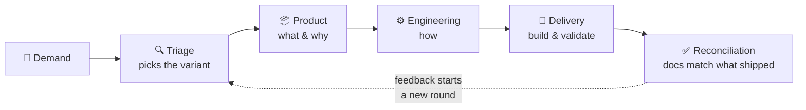
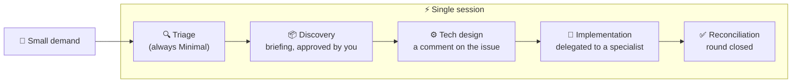
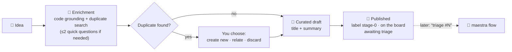

# maestra

Plugin for **OpenCode** and **Mimo Code** that facilitates the team's development workflow (triage → three stages → reconciliation, with gates and four depth variants), replacing Mesa: a **single facilitator agent** drives demands from free text to the reconciled round, with **state derived from the issue platform** — never local to the session — and behavior defined in lean *instructions*. The issue platform is the memory; the plugin is the discipline.

## How the flow works

Maestra takes a demand from free text all the way to a reconciled round. All state lives on the issue platform (GitHub/GitLab), never in the session. Pick the agent that matches your demand:

**🤖 `maestra` — the standard flow.** For demands that benefit from stage fragmentation: each stage ends in a session handoff, and triage classifies the demand into one of four depth variants (Completo, Condensado, Mínimo, Técnica).



**⚡ `maestra-direct` — everything in one session.** For small demands: the same Minimal flow, without session handoffs — each stage boundary becomes just the next turn of the conversation.



**✍️ `maestra-issue-writer` — quick capture.** Register an idea now, triage it later. Before drafting, it does a quick bounded enrichment: if your demand cites code, it verifies what that code does today (one verified sentence), and it always searches the board for duplicates — you never publish a likely duplicate without seeing it first.



Each stage only starts when the previous one is complete, and acceptance criteria are mandatory in **every** variant — what changes is how much each stage produces. The normative source of truth is [fluxo-de-desenvolvimento.md](../fluxo-de-desenvolvimento.md).

## Installation

**Single line (curl):**

```bash
curl -fsSL https://raw.githubusercontent.com/hacklabr/maestra/main/install.sh | bash
```

**From clone (installs/updates and generates everything):**

```bash
git clone https://github.com/hacklabr/maestra
cd Fluxo/maestra
bash install.sh                    # auto-detects present hosts
bash install.sh --host both        # or: opencode | mimocode
bash install.sh --tag v1.0.0       # pins a version (clone/update mode)
```

**Via npx (already published package):**

```bash
npx maestra              # detects the host automatically
npx maestra --host opencode
npx maestra --host mimocode
npx maestra --host both
```

What the installer does (in all three ways): installs dependencies and compiles (`tsc`), copies instructions to `<host-config>/maestra/instructions/` (including the **complete greppable persona catalog** in `instructions/catalog/`), generates `agents/maestra.md` with the **correct host dialect** (one host per machine — resolved at install time), generates the direct-mode agent `agents/maestra-direct.md` (Minimal flow in a single session), generates the capture-only agent `agents/maestra-issue-writer.md` (quick capture with label `stage-0`, no triage), generates the shell subagent `agents/maestra/specialist.md` (non-hidden, 1-line description) and the ops subagent `agents/maestra/ops.md` (git + issue-platform CLI mechanics, distilled results only), and registers the plugin in `opencode.json` / `mimocode.json`.

## Primary agents

The plugin installs **three** primary agents and **one** operations subagent:

| Agent | Mode | When to use |
|---|---|---|
| `maestra` | Standard (async) | Demands that benefit from stage fragmentation — each stage (Product → Engineering → Delivery) ends with an async gate boundary, a session handoff |
| `maestra-direct` | Direct (synchronous) | Small demands that don't need async fragmentation — the entire Minimal flow runs in a **single session** |
| `maestra-issue-writer` | Capture-only | Register a demand for later without interrogation — publishes the issue with label `stage-0` in ≤2 exchanges, no triage |
| `maestra/ops` | Subagent (delegated, not switchable) | Executes git + platform CLI mechanics on behalf of the facilitator, returning distilled results (retries stay inside) |

## Direct mode (modo direto)

In direct mode, the async gate boundaries of the standard flow become **turn boundaries within the same session**: triage → discovery → technical design → implementation → reconciliation all happen without session handoffs. The gates (acceptance criteria, out of scope, verdict per criterion, deviation declaration) are **not skipped** — they are verified as turn boundaries instead of session boundaries. Direct mode is less ceremony, not less rigor.

Switch with `/agent maestra-direct`. The direct-mode kernel lives at `instructions/kernel/maestra-direct-kernel.md`.

## Issue writer (quick capture)

`maestra-issue-writer` is a capture-only agent: every message is treated as capture intent. It drafts the issue in the author's words, waits for explicit confirmation, and publishes with the `stage-0` label (+ board + awaiting-triage comment). It NEVER triages, classifies, assigns variants, emits events A–F, or creates round folders. Use it to register an idea for later; to triage a captured issue, switch to the `maestra` agent and say "triage #N". Capture logic lives in `instructions/journeys/j11-quick-capture.md` (referenced, never restated); the kernel is `instructions/kernel/issue-writer-kernel.md`. Switch with `/agent maestra-issue-writer`.

## Discussion panel: shell specialist (design A)

Instead of registering personas as subagents (Mesa registers ~369 — each becomes a line in the subagent tool description, ~22k permanent tokens per session), the plugin installs **a single nearly empty subagent** (`maestra/specialist`). When convening the panel, the facilitator:

1. picks the persona from the greppable catalog (`instructions/catalog/<division>/<persona>.md`) — recipe: `grep -ril "<domain>" instructions/catalog/ | head -5`, then `read` the chosen file;
2. invokes the shell via the host's subagent tool (`task` in OpenCode / `actor` in Mimo) **with the persona content inline in the delegation prompt** — the persona travels as the first message of the shell's fresh session;
3. the shell declares the persona name and analyzes the agenda from it.

Cost: 1 line in the subagent enum (~60 tokens/msg) instead of 12+. Works identically on both hosts (verified in the sources: OpenCode's `describeTask` doesn't filter hidden; Mimo's `actor` enum filters `!hidden`). **No search tool** — native grep suffices; a promotion trigger for a `maestra_catalog_search` is in [ROADMAP.md](ROADMAP.md), alongside the persona-via-`system.transform` upgrade (phase 2).

## Operations specialist: maestra/ops

`maestra/ops` absorbs git and issue-platform CLI trial-and-error away from facilitator sessions. The facilitator delegates **named operations** (never raw commands) via the host's subagent tool (`task`/`actor`); the subagent executes the mechanics and returns only a distilled result — a success summary or the final error, with retries and error trails never leaving the subagent. Its kernel lives at `instructions/kernel/ops-kernel.md` (referenced, never restated).

## Supported issue platforms

- **GitHub** (github.com and Enterprise) — primary dogfooding platform
- **GitLab** (gitlab.com and self-hosted) — full dual support since the MVP, via canonical epic-as-issue mapping + `relates_to` links + tasklist (ADR-011)

The platform is **not** baked in at install time: it is detected **per repository** (`config.md` on the orphan branch `__maestra_config__` → remote → probe → single persisted question — ADR-010/ADR-003). The same plugin serves repos on different platforms on the same machine.

## What the plugin exposes

| Item | Type | Purpose |
|---|---|---|
| `maestra_status` | tool | Environment probe: host, issue platform, authenticated CLI (`gh`×`glab`), capability matrix, board access |
| `maestra_issue_digest` | tool | Factual parser of the workflow conventions (labels, epic→tasks hierarchy, gate/override comments, gate fields, reconciliation). **Enumerates facts; never derives state** |
| `ask_peer` | tool | Specialist↔specialist consultation within the sequential discussion panel (anti-cycle via busy-check; facilitator excluded by caller-identity) |
| `maestra_emit_event` | tool | Emits instrumentation events A–F + `type=override`, with "— facilitator" signature by construction |
| `desvios.md` hook | hook | Post-write validation of the planned→implemented→reason triplet in `docs/rounds/*/desvios.md`. **Flag, never block** |
| `maestra-report` | CLI script | Presence-gap audit: epic without event A, closed round without F, override without D, E parity, FM-13 |
| `maestra-config` | CLI script | Per-repo configuration on the orphan branch `__maestra_config__` (ADR-003): `migrate` (idempotent legacy `.maestra/` migration), `read`/`write` for `config.md`, `team.md`, `labels.md` (commit + best-effort push) |

## Instructions architecture (L0–L4)

- **L0 kernel** (~2.5k tokens, always resident): role, entry-doors router (issue number → J2, setup intent → J12, capture intent → J11, free text → J1), the anti-bypass as one-line triggers, tools contract — platform-neutral vocabulary.
- **L1/L2 journey modules** (J1–J12), loaded on demand; **L3/L4 reference library**: editable microcopy, protocols, templates and cookbooks per platform (`cookbook-github.md`, `cookbook-gitlab.md` — the CLI dialect lives only in them).
- Typical session ≈ 6–8k tokens of instructions (vs ~27k monolithic; toolset ≈ 1k tokens/msg vs Mesa's ~8–12k).

## Evals — "harness or no-dogfood"

The probabilistic shell (instructions, conversational anti-bypass) is verified by **evals** (promptfoo, pinned model, temp 0, 3 passes): deterministic tier + LLM-as-judge + golden transcripts. PR gate runs the fast ones + the 16 anti-bypass battery; nightly runs the full matrix. **Binding condition (spec D7): if the eval harness slips, there is no dogfooding.**

## Development

```bash
npm install
npm run build         # tsc + copy instructions to dist/
npm test              # vitest (unit + integration against gh/glab stubs)
npm run smoke         # 4-cell smoke: 2 hosts × 2 platforms
npm run eval:dry      # evals with mocked model (CI)
npm run eval          # evals with real model
npm run eval:nightly  # full matrix, no cache
npm run eval:golden   # golden transcripts
npm run ci            # build + typecheck + test + check:vocab + check:dist + smoke + eval:dry
```

## Documentation

- **[ROADMAP.md](ROADMAP.md)** — everything left out of the MVP, with objective trigger per item (phase 2, larger roadmap, technical debt, validation path)
- **[fluxo-de-desenvolvimento.md](../fluxo-de-desenvolvimento.md)** — the process the plugin facilitates (normative source of truth)
- **[docs/reference/journeys.md](../docs/reference/journeys.md)** — journeys J1–J10, protocols, microcopy and the 16 anti-bypass (audit spec)
